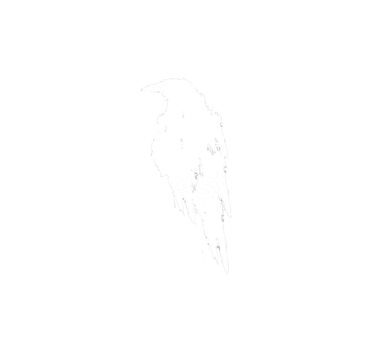
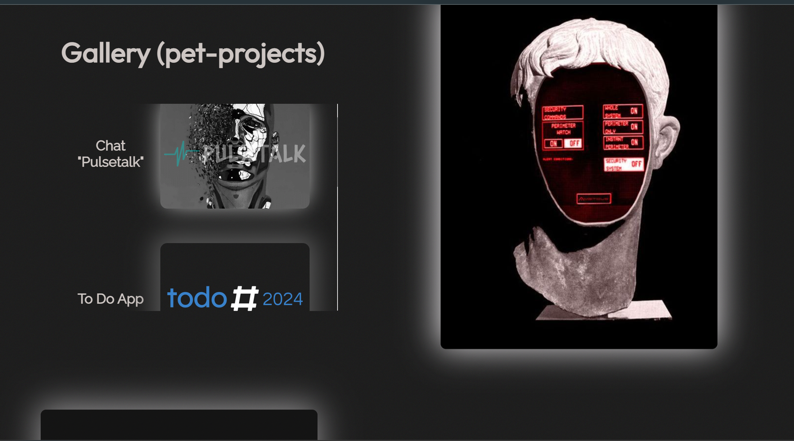
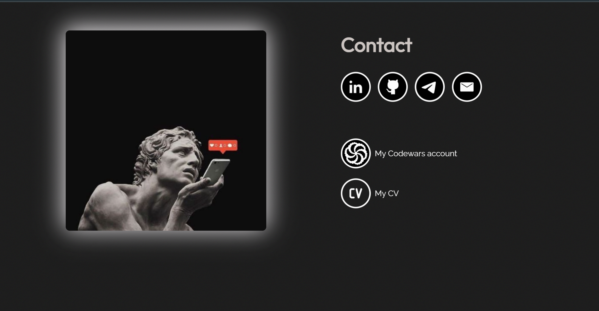

  
  <h1>CV Card</h1>

___

#### The application is available online at this url: [https://todo2024.onrender.com/](https://cv-card.onrender.com/)

##### RU version : https://cv-pg.ru/
___

### Description:

  
  
  
  

